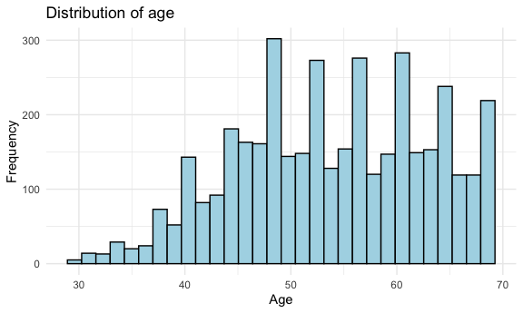
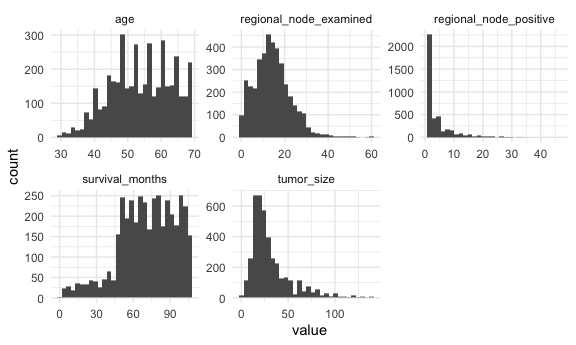
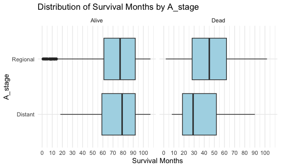
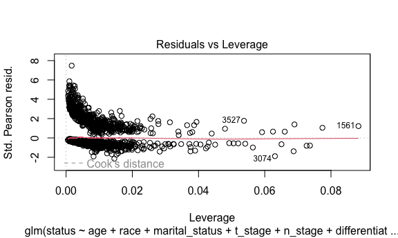
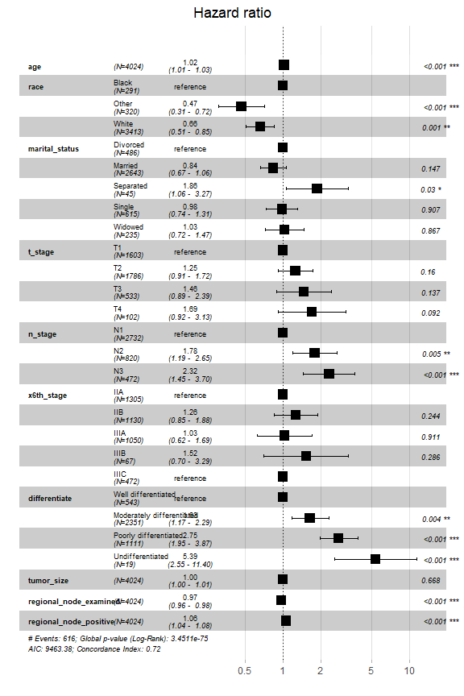

P8130_final_project
================
Leonor Rui
2024-12-03

# Appendix

- Data Import

``` r
survival_df = read_csv("data/Project_2_data.csv") |>
  janitor::clean_names()
```

- Data Description

``` r
str(survival_df)
```

    ## spc_tbl_ [4,024 × 16] (S3: spec_tbl_df/tbl_df/tbl/data.frame)
    ##  $ age                   : num [1:4024] 68 50 58 58 47 51 51 40 40 69 ...
    ##  $ race                  : chr [1:4024] "White" "White" "White" "White" ...
    ##  $ marital_status        : chr [1:4024] "Married" "Married" "Divorced" "Married" ...
    ##  $ t_stage               : chr [1:4024] "T1" "T2" "T3" "T1" ...
    ##  $ n_stage               : chr [1:4024] "N1" "N2" "N3" "N1" ...
    ##  $ x6th_stage            : chr [1:4024] "IIA" "IIIA" "IIIC" "IIA" ...
    ##  $ differentiate         : chr [1:4024] "Poorly differentiated" "Moderately differentiated" "Moderately differentiated" "Poorly differentiated" ...
    ##  $ grade                 : chr [1:4024] "3" "2" "2" "3" ...
    ##  $ a_stage               : chr [1:4024] "Regional" "Regional" "Regional" "Regional" ...
    ##  $ tumor_size            : num [1:4024] 4 35 63 18 41 20 8 30 103 32 ...
    ##  $ estrogen_status       : chr [1:4024] "Positive" "Positive" "Positive" "Positive" ...
    ##  $ progesterone_status   : chr [1:4024] "Positive" "Positive" "Positive" "Positive" ...
    ##  $ regional_node_examined: num [1:4024] 24 14 14 2 3 18 11 9 20 21 ...
    ##  $ reginol_node_positive : num [1:4024] 1 5 7 1 1 2 1 1 18 12 ...
    ##  $ survival_months       : num [1:4024] 60 62 75 84 50 89 54 14 70 92 ...
    ##  $ status                : chr [1:4024] "Alive" "Alive" "Alive" "Alive" ...
    ##  - attr(*, "spec")=
    ##   .. cols(
    ##   ..   Age = col_double(),
    ##   ..   Race = col_character(),
    ##   ..   `Marital Status` = col_character(),
    ##   ..   `T Stage` = col_character(),
    ##   ..   `N Stage` = col_character(),
    ##   ..   `6th Stage` = col_character(),
    ##   ..   differentiate = col_character(),
    ##   ..   Grade = col_character(),
    ##   ..   `A Stage` = col_character(),
    ##   ..   `Tumor Size` = col_double(),
    ##   ..   `Estrogen Status` = col_character(),
    ##   ..   `Progesterone Status` = col_character(),
    ##   ..   `Regional Node Examined` = col_double(),
    ##   ..   `Reginol Node Positive` = col_double(),
    ##   ..   `Survival Months` = col_double(),
    ##   ..   Status = col_character()
    ##   .. )
    ##  - attr(*, "problems")=<externalptr>

Numeric variables include `age`, `tumor_size`, `regional_node_examined`,
`reginol_node_positive`, and `survival_months`.

These are continuous variables that can be used for our later regression
analysis.

Categorical variables include `race`, `marital_status`, `t_stage`,
`n_stage`, `x6th_stage`, `differentiate`, `grade`, `a_stage`,
`estrogen_status`, `progesterone_status`, and `status`.

Then we will convert these variables into factors.

``` r
survival_df = survival_df |>
  mutate(
    race = factor(race),
    marital_status = factor(marital_status),
    t_stage = factor(t_stage),
    n_stage = factor(n_stage),
    x6th_stage = factor(x6th_stage),
    differentiate = factor(differentiate),
    grade = factor(grade),
    a_stage = factor(a_stage),
    estrogen_status = factor(estrogen_status),
    progesterone_status = factor(progesterone_status),
    status = factor(status)
  ) |>
  mutate(
    differentiate = factor(differentiate, levels = c("Well differentiated", 
                                                     "Moderately differentiated",
                                                     "Poorly differentiated",
                                                     "Undifferentiated")),
    differentiate = relevel(differentiate, ref = "Well differentiated")
  )
```

``` r
summary(survival_df)
```

    ##       age           race        marital_status t_stage   n_stage   x6th_stage 
    ##  Min.   :30.00   Black: 291   Divorced : 486   T1:1603   N1:2732   IIA :1305  
    ##  1st Qu.:47.00   Other: 320   Married  :2643   T2:1786   N2: 820   IIB :1130  
    ##  Median :54.00   White:3413   Separated:  45   T3: 533   N3: 472   IIIA:1050  
    ##  Mean   :53.97                Single   : 615   T4: 102             IIIB:  67  
    ##  3rd Qu.:61.00                Widowed  : 235                       IIIC: 472  
    ##  Max.   :69.00                                                                
    ##                    differentiate                   grade          a_stage    
    ##  Well differentiated      : 543   1                   : 543   Distant :  92  
    ##  Moderately differentiated:2351   2                   :2351   Regional:3932  
    ##  Poorly differentiated    :1111   3                   :1111                  
    ##  Undifferentiated         :  19   anaplastic; Grade IV:  19                  
    ##                                                                              
    ##                                                                              
    ##    tumor_size     estrogen_status progesterone_status regional_node_examined
    ##  Min.   :  1.00   Negative: 269   Negative: 698       Min.   : 1.00         
    ##  1st Qu.: 16.00   Positive:3755   Positive:3326       1st Qu.: 9.00         
    ##  Median : 25.00                                       Median :14.00         
    ##  Mean   : 30.47                                       Mean   :14.36         
    ##  3rd Qu.: 38.00                                       3rd Qu.:19.00         
    ##  Max.   :140.00                                       Max.   :61.00         
    ##  reginol_node_positive survival_months   status    
    ##  Min.   : 1.000        Min.   :  1.0   Alive:3408  
    ##  1st Qu.: 1.000        1st Qu.: 56.0   Dead : 616  
    ##  Median : 2.000        Median : 73.0               
    ##  Mean   : 4.158        Mean   : 71.3               
    ##  3rd Qu.: 5.000        3rd Qu.: 90.0               
    ##  Max.   :46.000        Max.   :107.0

The majority of patients in the dataset are White, accounting for
approximately 84.82% of the total population. Black patients make up
7.23%, and patients classified as “Other” constitute 7.95%. This
imbalance suggests that the dataset is heavily skewed towards White
patients, which could influence the generalizability of the findings to
other racial groups.

The wide range of values in variables such as `tumor_size`,
`regional_node_examined`, and `survival_months` indicates the need to
explore relationships and their potential nonlinearities with survival,
giving us a possible analytical regression model.

``` r
colSums(is.na(survival_df))
```

    ##                    age                   race         marital_status 
    ##                      0                      0                      0 
    ##                t_stage                n_stage             x6th_stage 
    ##                      0                      0                      0 
    ##          differentiate                  grade                a_stage 
    ##                      0                      0                      0 
    ##             tumor_size        estrogen_status    progesterone_status 
    ##                      0                      0                      0 
    ## regional_node_examined  reginol_node_positive        survival_months 
    ##                      0                      0                      0 
    ##                 status 
    ##                      0

We can conclude that no missing values are present in this dataset
across all variables.

``` r
survival_df |>
  group_by(differentiate, race) |>
  summarise(count = n(), .groups = "drop") |>
  pivot_wider(
    names_from = differentiate,
    values_from = count,
    values_fill = list(count = 0)
  )
```

    ## # A tibble: 3 × 5
    ##   race  `Well differentiated` `Moderately differentiated` Poorly differentiate…¹
    ##   <fct>                 <int>                       <int>                  <int>
    ## 1 Black                    32                         141                    115
    ## 2 Other                    46                         180                     94
    ## 3 White                   465                        2030                    902
    ## # ℹ abbreviated name: ¹​`Poorly differentiated`
    ## # ℹ 1 more variable: Undifferentiated <int>

This table shows the frequency of different levels of `differentiate` by
races.

``` r
survival_df |>
  group_by(x6th_stage, status) |>
  summarise(count = n(), .groups = "drop") |>
  pivot_wider(
    names_from = status,
    values_from = count
  )
```

    ## # A tibble: 5 × 3
    ##   x6th_stage Alive  Dead
    ##   <fct>      <int> <int>
    ## 1 IIA         1209    96
    ## 2 IIB          995   135
    ## 3 IIIA         866   184
    ## 4 IIIB          47    20
    ## 5 IIIC         291   181

This table shows the frequency of different levels of `status` by 6th
stage.

- Data Visualization

# Distributions of the numeric variables

## Age

``` r
survival_df |> 
  ggplot(aes(age)) + 
  geom_histogram(fill = "light blue", color = "black") + 
  theme_minimal() +
  labs(
    title = "Distribution of age",
    x = "Age",
    y = "Frequency"
  )
```


The histogram shows the age distribution of patients. Most patients are
aged between 40 and 70 years. The data is well spread across middle and
older age groups, making it possible for age-related analysis.
Therefore, age will likely be a significant predictor for later
analysis.

## Tumor size

``` r
ggplot(survival_df, aes(x = tumor_size)) +
  geom_histogram(fill = "light blue", color = "black") +
  scale_x_continuous(breaks = seq(0, max(survival_df$tumor_size, na.rm = TRUE), by = 5)) +
  labs(
    title = "Distribution of Tumor Size",
    x = "Tumor Size (mm)",
    y = "Frequency"
  )
```



This is the distribution of all tumor sizes, and most of the tumor sizes
are smaller than 50 mm. We can find that the most frequent size is
around 19 mm, followed by around 14 mm. This distribution is
right-skewed, so we will use the log transformation for this variable.

## Examined regional node

``` r
ggplot(survival_df, aes(x = regional_node_examined)) +
  geom_histogram(fill = "light blue", color = "black") +
  scale_x_continuous(breaks = seq(0, max(survival_df$regional_node_examined, na.rm = TRUE), by = 5)) +
  labs(
    title = "Distribution of Examined Regional Node",
    x = "Examined Regional Node",
    y = "Frequency"
  )
```



This plot maps the frequency of different number of examined regional
nodes for each subject. The number of examined regional nodes for most
subjects are smaller than 30, and the subjects with nearly 12 examined
regional nodes are the most.

## Positive regional node

``` r
ggplot(survival_df, aes(x = reginol_node_positive)) +
  geom_histogram(fill = "light blue", color = "black") +
  scale_x_continuous(breaks = seq(0, max(survival_df$reginol_node_positive, na.rm = TRUE), by = 5)) +
  labs(
    title = "Distribution of Positive Reginol Node",
    x = "Positive Reginol Node",
    y = "Frequency"
  )
```


Then is the distribution of different number of positive reginol node
for each subject. Over 2500 subjects only have 1 or 2 positive reginol
nodes, which is the most frequent number of positive reginol nodes. It
is strongly right-skewed, so we will use the log transformation for this
variable.

## Cancer Grades

``` r
ggplot(survival_df, aes(x = grade)) +
    geom_bar(fill = "skyblue") +
    labs(title = "Frequency Distribution of Cancer Grades",
         x = "Grade",
         y = "Count") +
    theme_minimal()
```


This bar chart provides an overview of how cancer cases are distributed
across grades. Grade 2 represents the majority of cases, suggesting it
is the most frequently observed grade, while Grade IV is exceedingly
rare.

# Bewteen Variables

## Survival months by status

``` r
ggplot(survival_df, aes(x = survival_months, fill = status)) +
  geom_histogram(binwidth = 5, position = "dodge") +
  labs(title = "Distribution of Survival Months", x = "Survival Months", y = "Frequency") +
  theme_minimal()
```


The Dead group is concentrated in the shorter survival months, while the
Alive group is predominant in longer survival months, particularly
beyond 60 months.

## Tumor sizes by t_stage

``` r
ggplot(survival_df, aes(x = tumor_size, y = t_stage)) +
  geom_boxplot(fill = "light blue") +
  scale_x_continuous(breaks = seq(0, max(survival_df$tumor_size, na.rm = TRUE), by = 10)) +
  labs(
    title = "Distribution of Tumor Sizes by T_stage",
    x = "Tumor Sizes",
    y = "T_stage"
  )
```


In this plot, we explore the tumor size distribution at different T
stages. From T1 to T3, as the stage changes, both the mean tumor sizes
and IQR become larger. At T4 stage, the IQR of tumor sizes is much
larger than others, and the mean size is smaller than the mean size at
T3 stage. There are some outliers both ar T1 stage and T3 stage.

## Survival months by a_stage based on status(alive/dead)

``` r
ggplot(survival_df, aes(x = survival_months, y = a_stage)) +
  geom_boxplot(fill = "light blue") +
  scale_x_continuous(breaks = seq(0, max(survival_df$survival_months, na.rm = TRUE), by = 10)) +
  labs(
    title = "Distribution of Survival Months by A_stage",
    x = "Survival Months",
    y = "A_stage"
  ) +
  facet_grid(~ status)
```


Through this plot, we can find that subjects with Distant stage have
fewer survival months than subjects with Regional stage. However, the
IQR of the survival months of subjects with Distant stage is much larger
than subjects with Regional stage.

## Estrogen Status by Tumor Size Based on race

``` r
ggplot(survival_df, aes(x = progesterone_status, y = tumor_size)) +
  geom_boxplot(fill = "light blue") +
  labs(
    title = "Distribution of Estrogen Status by Tumor Size",
    x = "Estrogen Status",
    y = "Tumor Size"
  ) +
  facet_grid(~ race)
```



While the overall patterns are consistent, with Negative estrogen status
generally associated with slightly larger tumor sizes, the variability
and prevalence of outliers differ between groups. The White group shows
the greatest spread in tumor size, while the Other group displays the
least variability.

## Tumor Size by Grade

``` r
ggplot(survival_df, aes(x = grade, y = tumor_size)) +
  geom_boxplot(fill = "lightblue") +
  labs(title = "Tumor Size Distribution by Grade",
       x = "Grade",
       y = "Tumor Size (mm)") +
  theme_minimal()
```


Lower grades (1–3) exhibit comparable tumor size distributions, with
slight increases in variability as the grade increases.

Grade IV stands out due to its higher median and broader range,
suggesting that more aggressive tumor grades are associated with larger
tumor sizes.

## Proportion of Grade by Estrogen Status

``` r
ggplot(survival_df, aes(x = grade, fill = estrogen_status)) +
    geom_bar(position = "fill") +
    labs(title = "Proportion of Grade by Estrogen Status",
         x = "Grade",
         y = "Proportion",
         fill = "Race") +
    theme_minimal()
```


As tumor grade increases, the proportion of Negative estrogen status
gradually increases, becoming more prominent in the anaplastic Grade IV
category. Conversely, the dominance of the Positive estrogen status
decreases with higher tumor grades.

## Proportion of Grade by Marital Status

``` r
ggplot(survival_df, aes(x = grade, fill = marital_status)) +
    geom_bar(position = "fill") +
    labs(title = "Proportion of Grade by Marital Status",
         x = "Grade",
         y = "Proportion",
         fill = "Race") +
    theme_minimal()
```


Across all grades, the “Married” group consistently constitutes the
largest proportion of individuals, dominating every tumor grade
category.

The “Single” group is the second-largest proportion in most grades,
particularly Grades 2 and 3.

The “Widowed” group and “Divorced” group make up smaller proportions
across all tumor grades.

## Relationship Between Age and Tumor Size across status

``` r
ggplot(survival_df, aes(x = age, y = tumor_size, color = status)) +
    geom_point(alpha = 0.5, size = 0.6) +
  geom_smooth(method = "lm", color = "green") +
  facet_wrap(~ status) +
    labs(title = "Relationship Between Age and Tumor Size",
         x = "Age (years)",
         y = "Tumor Size (mm)",
         color = "Status") +
    theme_minimal()
```


This figure highlights the differences in tumor size distribution and
trends with age between individuals who are alive and those who are
deceased. While the “Alive” group shows no significant relationship
between age and tumor size, the “Dead” group exhibits a pattern where
larger tumors are associated with younger ages.

## Age vs. Tumor Size Across Grades

``` r
ggplot(survival_df, aes(x = age, y = tumor_size)) +
    geom_point(color = "lightblue", size = 0.8, alpha = 0.5) +
  geom_smooth(method = "lm") +
    facet_wrap(~ marital_status) +
    labs(title = "Age vs. Tumor Size Across Grades",
         x = "Age (years)",
         y = "Tumor Size (mm)") +
    theme_minimal()
```


Divorced: Tumor size seems to remain fairly constant with age, as the
trend line is relatively flat.

Married: A slight negative trend is observable, suggesting that tumor
size may decrease marginally with age.

Separated: The data is sparse, but the trend shows a slightly negative
relationship, with wide confidence intervals due to fewer observations.

Single: A modest negative trend is observed, indicating a potential
decline in tumor size with increasing age.

Widowed: A more apparent negative trend is evident compared to other
groups, suggesting a stronger decrease in tumor size with age.

## Positive Reginol Node vs Survival Months Across Cancer Grade

``` r
ggplot(survival_df, aes(x = reginol_node_positive, y = survival_months)) +
  geom_point(color = "light blue", size = 0.5, alpha = 0.5)  +
  facet_wrap(.~grade) +
  geom_smooth(method = "lm") +
  labs(
    title = "Distribution of Positive Reginol Node and Survival Months by Cancer Grade",
    x = "Positive Reginol Node",
    y = "Survival Months"
  ) +
  theme_minimal()
```


According to the trend lines, as the cancer grade increases, the
negative correlation between the number of positive reginol nodes and
the survival months becomes stronger. At the Grade IV, the correlation
is strong. AS the number of positive reginol nodes increases, the
survival months will decrease.

# Transformations

``` r
survival_df = survival_df |>
  mutate(
    log_tumor_size = log(tumor_size),
    log_reginol_node_positive = log(reginol_node_positive)
  )
```

Since variables `tumor_size` and `reginol_node_positive` are skewed to
the right, we need to use the log transformation and add new variables
`log_tumor_size` and `log_reginol_node_positive` for further analysis.

``` r
survival_df |> 
  pivot_longer(
    cols = c(age, tumor_size, regional_node_examined, reginol_node_positive, survival_months),
    names_to = "variable",
    values_to = "value"
  ) |>
  ggplot(aes(x = value)) +
  geom_histogram() +
  facet_wrap(variable ~ .,  scales = "free")
```



# Model Building

## Preparation

``` r
survival_df = 
  survival_df |>
  mutate(status = if_else(status == "Dead", 1, 0))

full_glm = glm(status ~ age + race + marital_status + t_stage + n_stage + x6th_stage +
                 differentiate + grade + a_stage + tumor_size + estrogen_status +
                 progesterone_status + regional_node_examined + reginol_node_positive, 
               data = survival_df, family = binomial)

alias(full_glm)$Complete %>%
  as.data.frame() %>%  
  rownames_to_column("aliased_variables") %>% 
  as_tibble() %>% 
  pivot_longer(
    cols = -aliased_variables,
    names_to = "aliased_with", 
    values_to = "value"
  ) %>% 
  filter(value != 0) %>% 
  select(-value)
```

    ## # A tibble: 4 × 2
    ##   aliased_variables         aliased_with                          
    ##   <chr>                     <chr>                                 
    ## 1 x6th_stageIIIC            n_stageN3                             
    ## 2 grade2                    differentiateModerately differentiated
    ## 3 grade3                    differentiatePoorly differentiated    
    ## 4 gradeanaplastic; Grade IV differentiateUndifferentiated

First, we use variables 1-14 to build a logistic regression. In this
full model, we observe that the number of each level in the variable
`grade` is the same as the variable `differentiate`, and the number of
level `IIIC` in the variable `x6th_stage` is exactly the same with level
`N3` in the variable `n_stage`.

By looking up the relevant information on the staging system for breast
cancer, we can see that the breast cancer grade (i.e. variable `grade`)
is based on how much the cancer cells look like normal cells, which is
highly similar to the meaning of the variable `differentiate`.
Therefore, the variable `grade` can be removed from the model.

In addition, the AJCC system (variable `x6th_stage`) is based on 7
aspects: the extent (size) of the tumor (T), the spread to nearby lymph
nodes (N), the spread (metastasis) to distant sites (M), Estrogen
Receptor (ER) status, Progesterone Receptor (PR) status, HER2 status and
grade of the cancer (G). It can be seen that some of the evaluation
criteria are already included in other variables.

However, since the AJCC system is complex and levels other than `IIIC`
do not correlate with other variables, we cannot simply remove this
variable from the model. We will discuss this variable further when it
comes to this.

## Logistic Regression Model

### Automated Procedure

#### Forward Selection

``` r
full_glm = glm(status ~ age + race + marital_status + t_stage + n_stage + x6th_stage +
                 differentiate + a_stage + tumor_size + estrogen_status +
                 progesterone_status + regional_node_examined + reginol_node_positive, 
               data = survival_df, family = binomial)

forward_glm = MASS::stepAIC(full_glm, direction = "forward", trace = FALSE)

forward_glm %>% 
  broom::tidy() %>% 
  knitr::kable()
```

| term                                   |   estimate | std.error |  statistic |   p.value |
|:---------------------------------------|-----------:|----------:|-----------:|----------:|
| (Intercept)                            | -2.3128223 | 0.5137669 | -4.5016957 | 0.0000067 |
| age                                    |  0.0241699 | 0.0056199 |  4.3007984 | 0.0000170 |
| raceOther                              | -0.9235406 | 0.2486035 | -3.7149140 | 0.0002033 |
| raceWhite                              | -0.5097774 | 0.1618144 | -3.1503827 | 0.0016306 |
| marital_statusMarried                  | -0.2102748 | 0.1417668 | -1.4832442 | 0.1380095 |
| marital_statusSeparated                |  0.6717802 | 0.3874652 |  1.7337821 | 0.0829568 |
| marital_statusSingle                   | -0.0677682 | 0.1750670 | -0.3870986 | 0.6986832 |
| marital_statusWidowed                  |  0.0234528 | 0.2210320 |  0.1061061 | 0.9154982 |
| t_stageT2                              |  0.2821932 | 0.1953845 |  1.4442965 | 0.1486556 |
| t_stageT3                              |  0.5359069 | 0.3137751 |  1.7079331 | 0.0876488 |
| t_stageT4                              |  0.9542320 | 0.4500716 |  2.1201781 | 0.0339910 |
| n_stageN2                              |  0.6208066 | 0.2391834 |  2.5955259 | 0.0094446 |
| n_stageN3                              |  0.6910134 | 0.3007413 |  2.2977003 | 0.0215789 |
| x6th_stageIIB                          |  0.2143223 | 0.2318280 |  0.9244883 | 0.3552321 |
| x6th_stageIIIA                         | -0.0871350 | 0.2950089 | -0.2953639 | 0.7677159 |
| x6th_stageIIIB                         |  0.0887019 | 0.5289101 |  0.1677069 | 0.8668139 |
| x6th_stageIIIC                         |         NA |        NA |         NA |        NA |
| differentiateModerately differentiated |  0.5367572 | 0.1840814 |  2.9158684 | 0.0035470 |
| differentiatePoorly differentiated     |  0.9251853 | 0.1928527 |  4.7973682 | 0.0000016 |
| differentiateUndifferentiated          |  1.8983208 | 0.5566714 |  3.4101279 | 0.0006493 |
| a_stageRegional                        | -0.0401504 | 0.2662370 | -0.1508068 | 0.8801281 |
| tumor_size                             |  0.0002492 | 0.0039726 |  0.0627193 | 0.9499900 |
| estrogen_statusPositive                | -0.7418514 | 0.1778875 | -4.1703414 | 0.0000304 |
| progesterone_statusPositive            | -0.5860593 | 0.1276841 | -4.5899160 | 0.0000044 |
| regional_node_examined                 | -0.0358800 | 0.0071869 | -4.9924273 | 0.0000006 |
| reginol_node_positive                  |  0.0790803 | 0.0153636 |  5.1472588 | 0.0000003 |

#### Backward Elimination

``` r
backward_glm = MASS::stepAIC(full_glm, direction = "backward", trace = FALSE)

backward_glm %>% 
  broom::tidy() %>% 
  knitr::kable()
```

| term                                   |   estimate | std.error |  statistic |   p.value |
|:---------------------------------------|-----------:|----------:|-----------:|----------:|
| (Intercept)                            | -2.2838315 | 0.4384836 | -5.2084769 | 0.0000002 |
| age                                    |  0.0238007 | 0.0056100 |  4.2425819 | 0.0000221 |
| raceOther                              | -0.9345816 | 0.2484557 | -3.7615615 | 0.0001689 |
| raceWhite                              | -0.5148243 | 0.1616638 | -3.1845366 | 0.0014499 |
| marital_statusMarried                  | -0.2110346 | 0.1416356 | -1.4899823 | 0.1362289 |
| marital_statusSeparated                |  0.6691400 | 0.3881385 |  1.7239720 | 0.0847129 |
| marital_statusSingle                   | -0.0646133 | 0.1748158 | -0.3696077 | 0.7116748 |
| marital_statusWidowed                  |  0.0174933 | 0.2210705 |  0.0791300 | 0.9369292 |
| t_stageT2                              |  0.4111129 | 0.1130295 |  3.6372161 | 0.0002756 |
| t_stageT3                              |  0.5515947 | 0.1487720 |  3.7076523 | 0.0002092 |
| t_stageT4                              |  1.0987803 | 0.2445294 |  4.4934479 | 0.0000070 |
| n_stageN2                              |  0.4362925 | 0.1283709 |  3.3986873 | 0.0006771 |
| n_stageN3                              |  0.5871676 | 0.2345455 |  2.5034268 | 0.0122997 |
| differentiateModerately differentiated |  0.5327601 | 0.1837768 |  2.8989515 | 0.0037441 |
| differentiatePoorly differentiated     |  0.9190270 | 0.1923771 |  4.7772156 | 0.0000018 |
| differentiateUndifferentiated          |  1.8648633 | 0.5538330 |  3.3671943 | 0.0007594 |
| estrogen_statusPositive                | -0.7480166 | 0.1775063 | -4.2140275 | 0.0000251 |
| progesterone_statusPositive            | -0.5841584 | 0.1275160 | -4.5810602 | 0.0000046 |
| regional_node_examined                 | -0.0359376 | 0.0071717 | -5.0110048 | 0.0000005 |
| reginol_node_positive                  |  0.0796837 | 0.0153014 |  5.2075987 | 0.0000002 |

#### Stepwise Regression

``` r
stepwise_glm = step(full_glm)
```

    ## Start:  AIC=3002
    ## status ~ age + race + marital_status + t_stage + n_stage + x6th_stage + 
    ##     differentiate + a_stage + tumor_size + estrogen_status + 
    ##     progesterone_status + regional_node_examined + reginol_node_positive
    ## 
    ##                          Df Deviance    AIC
    ## - x6th_stage              3   2953.7 2997.7
    ## - tumor_size              1   2952.0 3000.0
    ## - a_stage                 1   2952.0 3000.0
    ## - t_stage                 3   2957.2 3001.2
    ## <none>                        2952.0 3002.0
    ## - marital_status          4   2960.1 3002.1
    ## - n_stage                 1   2958.9 3006.9
    ## - race                    2   2967.1 3013.1
    ## - estrogen_status         1   2969.2 3017.2
    ## - age                     1   2970.8 3018.8
    ## - progesterone_status     1   2972.0 3020.0
    ## - regional_node_examined  1   2978.7 3026.7
    ## - reginol_node_positive   1   2978.8 3026.8
    ## - differentiate           3   2986.0 3030.0
    ## 
    ## Step:  AIC=2997.73
    ## status ~ age + race + marital_status + t_stage + n_stage + differentiate + 
    ##     a_stage + tumor_size + estrogen_status + progesterone_status + 
    ##     regional_node_examined + reginol_node_positive
    ## 
    ##                          Df Deviance    AIC
    ## - tumor_size              1   2953.8 2995.8
    ## - a_stage                 1   2953.8 2995.8
    ## <none>                        2953.7 2997.7
    ## - marital_status          4   2961.7 2997.7
    ## - n_stage                 2   2965.5 3005.5
    ## - t_stage                 3   2968.8 3006.8
    ## - race                    2   2969.2 3009.2
    ## - estrogen_status         1   2971.2 3013.2
    ## - age                     1   2972.1 3014.1
    ## - progesterone_status     1   2973.6 3015.6
    ## - regional_node_examined  1   2980.4 3022.4
    ## - reginol_node_positive   1   2981.1 3023.1
    ## - differentiate           3   2987.4 3025.4
    ## 
    ## Step:  AIC=2995.75
    ## status ~ age + race + marital_status + t_stage + n_stage + differentiate + 
    ##     a_stage + estrogen_status + progesterone_status + regional_node_examined + 
    ##     reginol_node_positive
    ## 
    ##                          Df Deviance    AIC
    ## - a_stage                 1   2953.8 2993.8
    ## <none>                        2953.8 2995.8
    ## - marital_status          4   2961.8 2995.8
    ## - n_stage                 2   2965.7 3003.7
    ## - race                    2   2969.2 3007.2
    ## - estrogen_status         1   2971.2 3011.2
    ## - age                     1   2972.1 3012.1
    ## - progesterone_status     1   2973.7 3013.7
    ## - t_stage                 3   2980.8 3016.8
    ## - regional_node_examined  1   2980.6 3020.6
    ## - reginol_node_positive   1   2981.1 3021.1
    ## - differentiate           3   2987.4 3023.4
    ## 
    ## Step:  AIC=2993.77
    ## status ~ age + race + marital_status + t_stage + n_stage + differentiate + 
    ##     estrogen_status + progesterone_status + regional_node_examined + 
    ##     reginol_node_positive
    ## 
    ##                          Df Deviance    AIC
    ## <none>                        2953.8 2993.8
    ## - marital_status          4   2961.8 2993.8
    ## - n_stage                 2   2965.8 3001.8
    ## - race                    2   2969.3 3005.3
    ## - estrogen_status         1   2971.3 3009.3
    ## - age                     1   2972.1 3010.1
    ## - progesterone_status     1   2973.7 3011.7
    ## - t_stage                 3   2982.7 3016.7
    ## - regional_node_examined  1   2980.6 3018.6
    ## - reginol_node_positive   1   2981.1 3019.1
    ## - differentiate           3   2987.4 3021.4

``` r
stepwise_glm %>% 
  broom::tidy() %>% 
  knitr::kable()
```

| term                                   |   estimate | std.error |  statistic |   p.value |
|:---------------------------------------|-----------:|----------:|-----------:|----------:|
| (Intercept)                            | -2.2838315 | 0.4384836 | -5.2084769 | 0.0000002 |
| age                                    |  0.0238007 | 0.0056100 |  4.2425819 | 0.0000221 |
| raceOther                              | -0.9345816 | 0.2484557 | -3.7615615 | 0.0001689 |
| raceWhite                              | -0.5148243 | 0.1616638 | -3.1845366 | 0.0014499 |
| marital_statusMarried                  | -0.2110346 | 0.1416356 | -1.4899823 | 0.1362289 |
| marital_statusSeparated                |  0.6691400 | 0.3881385 |  1.7239720 | 0.0847129 |
| marital_statusSingle                   | -0.0646133 | 0.1748158 | -0.3696077 | 0.7116748 |
| marital_statusWidowed                  |  0.0174933 | 0.2210705 |  0.0791300 | 0.9369292 |
| t_stageT2                              |  0.4111129 | 0.1130295 |  3.6372161 | 0.0002756 |
| t_stageT3                              |  0.5515947 | 0.1487720 |  3.7076523 | 0.0002092 |
| t_stageT4                              |  1.0987803 | 0.2445294 |  4.4934479 | 0.0000070 |
| n_stageN2                              |  0.4362925 | 0.1283709 |  3.3986873 | 0.0006771 |
| n_stageN3                              |  0.5871676 | 0.2345455 |  2.5034268 | 0.0122997 |
| differentiateModerately differentiated |  0.5327601 | 0.1837768 |  2.8989515 | 0.0037441 |
| differentiatePoorly differentiated     |  0.9190270 | 0.1923771 |  4.7772156 | 0.0000018 |
| differentiateUndifferentiated          |  1.8648633 | 0.5538330 |  3.3671943 | 0.0007594 |
| estrogen_statusPositive                | -0.7480166 | 0.1775063 | -4.2140275 | 0.0000251 |
| progesterone_statusPositive            | -0.5841584 | 0.1275160 | -4.5810602 | 0.0000046 |
| regional_node_examined                 | -0.0359376 | 0.0071717 | -5.0110048 | 0.0000005 |
| reginol_node_positive                  |  0.0796837 | 0.0153014 |  5.2075987 | 0.0000002 |

The backward and stepwise procedure produced the same model.

### Criterion-based Procedure

``` r
model_selection =
  tibble(
    type = c("full", "forward", "backward", "stepwise"),
    model = list(full_glm, forward_glm, backward_glm, stepwise_glm)
    ) %>%
  mutate(
    result = map(model, broom::glance)
    ) %>%
  unnest(result) %>%
  select(type, AIC, BIC)


model_selection %>%
  knitr::kable(digits = 3, caption = "Model Selection")
```

| type     |      AIC |      BIC |
|:---------|---------:|---------:|
| full     | 3002.000 | 3159.500 |
| forward  | 3002.000 | 3159.500 |
| backward | 2993.771 | 3119.771 |
| stepwise | 2993.771 | 3119.771 |

Model Selection

``` r
final_glm = stepwise_glm
```

The Akaike information criterion (AIC) is an estimator of prediction
error and thereby relative quality of statistical models for a given set
of data, and models with lower AIC are generally preferred. Similarly,
the Bayesian information criterion (BIC) is also a criterion for model
selection among a finite set of models. They both resolve the
overfitting problem by introducing a penalty term for the number of
parameters in the model.

By comparing AIC and BIC, we can see the model given by backward
elimination or stepwise regression works slightly better than the full
model or forward selection model. Therefore, we will choose the former
to be our “best model”.

### Model Diagnostics

``` r
vif(final_glm)
```

    ##                            GVIF Df GVIF^(1/(2*Df))
    ## age                    1.107154  1        1.052214
    ## race                   1.062865  2        1.015359
    ## marital_status         1.129117  4        1.015295
    ## t_stage                1.101923  3        1.016308
    ## n_stage                3.806780  2        1.396817
    ## differentiate          1.117097  3        1.018627
    ## estrogen_status        1.475424  1        1.214670
    ## progesterone_status    1.427536  1        1.194795
    ## regional_node_examined 1.477809  1        1.215651
    ## reginol_node_positive  4.248357  1        2.061154

Variance Inflation Factor is a commonly used method for detecting
multicollinearity in regression models. VIF is generally calculated for
the continuous variables, and Generalized Variance Inflation Factor
(GVIF) is used for evaluating the multicollinearity for categorical
variables.

The adjusted GVIF (i.e. GVIF^(1/(2\*Df))) values are corrected for the
degree of freedom and provide a scale similar to VIF. The high adjusted
GVIF values (GVIF \> 2) indicate the presence of moderate to strong
multicollinearity.

The table shows that most variables do not show multicollinearity, with
the exception of `reginol_node_positive`. Since its adjusted GVIF is not
much different from 2, we will keep this variable for now.

``` r
augment(final_glm) |>
  ggplot(aes(x = .fitted, y = .std.resid)) +
  geom_point() +
  geom_smooth(se = FALSE) +
  labs(x = "Fitted value", y = "Residual")
```


``` r
augment_quantile(final_glm) |>
  ggplot(aes(x = .fitted, y = .quantile.resid)) +
  geom_point() +
  geom_smooth(se = FALSE) +
  labs(x = "Fitted value", y = "Randomized quantile residual")
```


By randomizing the quantile residuals, we resolve the problem that the
RVF plot always shows a pattern in logistic regression because of the
binary response variable. Since in the randomized quantile residual
vs. fitted value plot, the residuals distribute randomly around the 0.5
horizontal line, the residual assumption is met and the model is a good
fit.

``` r
plot(final_glm, which = 5)
```


The residual vs. leverage plot indicates that observations 3527, 1561,
and 3074 may be potential outliers, but they are not necessarily
influential.

### Odds Ratios

``` r
final_glm_summary = summary(final_glm)

final_glm_df = 
  as.data.frame(final_glm_summary$coefficients) |>
  janitor::clean_names() |>
  mutate(
    odds_ratio = exp(estimate)
  ) |>
  rename(p_value = pr_z)

final_glm_df %>% 
  knitr::kable()
```

|                                        |   estimate | std_error |    z_value |   p_value | odds_ratio |
|:---------------------------------------|-----------:|----------:|-----------:|----------:|-----------:|
| (Intercept)                            | -2.2838315 | 0.4384836 | -5.2084769 | 0.0000002 |  0.1018931 |
| age                                    |  0.0238007 | 0.0056100 |  4.2425819 | 0.0000221 |  1.0240862 |
| raceOther                              | -0.9345816 | 0.2484557 | -3.7615615 | 0.0001689 |  0.3927502 |
| raceWhite                              | -0.5148243 | 0.1616638 | -3.1845366 | 0.0014499 |  0.5976056 |
| marital_statusMarried                  | -0.2110346 | 0.1416356 | -1.4899823 | 0.1362289 |  0.8097461 |
| marital_statusSeparated                |  0.6691400 | 0.3881385 |  1.7239720 | 0.0847129 |  1.9525574 |
| marital_statusSingle                   | -0.0646133 | 0.1748158 | -0.3696077 | 0.7116748 |  0.9374299 |
| marital_statusWidowed                  |  0.0174933 | 0.2210705 |  0.0791300 | 0.9369292 |  1.0176472 |
| t_stageT2                              |  0.4111129 | 0.1130295 |  3.6372161 | 0.0002756 |  1.5084956 |
| t_stageT3                              |  0.5515947 | 0.1487720 |  3.7076523 | 0.0002092 |  1.7360193 |
| t_stageT4                              |  1.0987803 | 0.2445294 |  4.4934479 | 0.0000070 |  3.0005041 |
| n_stageN2                              |  0.4362925 | 0.1283709 |  3.3986873 | 0.0006771 |  1.5469611 |
| n_stageN3                              |  0.5871676 | 0.2345455 |  2.5034268 | 0.0122997 |  1.7988859 |
| differentiateModerately differentiated |  0.5327601 | 0.1837768 |  2.8989515 | 0.0037441 |  1.7036280 |
| differentiatePoorly differentiated     |  0.9190270 | 0.1923771 |  4.7772156 | 0.0000018 |  2.5068500 |
| differentiateUndifferentiated          |  1.8648633 | 0.5538330 |  3.3671943 | 0.0007594 |  6.4550535 |
| estrogen_statusPositive                | -0.7480166 | 0.1775063 | -4.2140275 | 0.0000251 |  0.4733044 |
| progesterone_statusPositive            | -0.5841584 | 0.1275160 | -4.5810602 | 0.0000046 |  0.5575749 |
| regional_node_examined                 | -0.0359376 | 0.0071717 | -5.0110048 | 0.0000005 |  0.9647004 |
| reginol_node_positive                  |  0.0796837 | 0.0153014 |  5.2075987 | 0.0000002 |  1.0829445 |

### Cross Validation

``` r
log_loss = function(actual, predicted) {
  
  -mean(actual * log(predicted) + (1 - actual) * log(1 - predicted))
  
}

glm_fit = function(data) {
  
  fit = glm(formula = status ~ age + race + marital_status + t_stage + n_stage + 
        differentiate + estrogen_status + progesterone_status + 
        regional_node_examined + reginol_node_positive, 
        family = binomial, data = data)
  
  return(fit)
  
}

cv_df = 
  crossv_kfold(survival_df, k = 5) |>
  mutate(
    train = map(train, as_tibble),
    test = map(test, as_tibble)
  )


cv_res_df = 
  cv_df |>
  mutate(
    final_model = map(train, \(x) glm_fit(data = x)),
    log_loss = map2_dbl(final_model, test, \(model, test_data) {
      predicted_probs = predict(model, newdata = test_data, type = "response")
      actual_outcomes = test_data$status
      log_loss(actual_outcomes, predicted_probs)
    })
  )

cv_res_df = 
  cv_df |>
  mutate(
    final_model = map(train, \(x) glm_fit(data = x)),
    predicted_probs = map2(final_model, test, \(fit, data)
                               predict(fit, newdata = data, type = "response")),
    actual_outcomes = map(test, pull, status),
    log_loss = map2_dbl(actual_outcomes, predicted_probs, \(x, y) log_loss(x, y)),
    auc = map2_dbl(actual_outcomes, predicted_probs, \(x, y) {
      roc_obj = roc(x, y)  
      auc(roc_obj)  
    })
  )

cv_res_df %>% 
  select(log_loss, auc)
```

    ## # A tibble: 5 × 2
    ##   log_loss   auc
    ##      <dbl> <dbl>
    ## 1    0.373 0.720
    ## 2    0.365 0.708
    ## 3    0.385 0.773
    ## 4    0.371 0.764
    ## 5    0.364 0.763

``` r
CV_log_loss = mean(cv_res_df$log_loss)
CV_log_loss
```

    ## [1] 0.371593

Since the CV_log_loss is very small, the model is a good fit by cross
validation.

- Evaluate the performance of your model(s). Is your model achieving
  similar performance between the majority race group “White” and the
  minority “Black” (or “Black” + “Other”)? If not, could you try to
  improve the fairness (i.e., reducing the gap of prediction performance
  between the majority and minority) of your model(s)?

## Survival Analysis

``` r
surv_obj = Surv(time = survival_df$survival_months, event = survival_df$status)
```

### Kaplan Meier Curve

``` r
km_fit = survfit(surv_obj ~ 1, data = survival_df)

ggsurvfit(km_fit, type = "survival", linewidth = 1) +
  labs(x = "Months", 
       y = "Overall survival",
       title = "Kaplan-Meier Survival Curve") +
  add_confidence_interval() +
  add_risktable() +
  scale_ggsurvfit()
```


### Cox Regression

``` r
cox_model = coxph(surv_obj ~ 
                    age + race + marital_status + t_stage + n_stage + x6th_stage +
                       differentiate + a_stage + tumor_size + estrogen_status +
                       progesterone_status + regional_node_examined + reginol_node_positive, 
                  data = as.data.frame(survival_df))
cox.zph(cox_model)
```

    ##                          chisq df       p
    ## age                     0.1328  1 0.71556
    ## race                    0.9335  2 0.62702
    ## marital_status          2.6670  4 0.61500
    ## t_stage                 0.2144  3 0.97523
    ## n_stage                 1.7178  2 0.42362
    ## x6th_stage              3.8545  3 0.27761
    ## differentiate           1.8899  3 0.59557
    ## a_stage                 5.2218  1 0.02231
    ## tumor_size              0.9310  1 0.33460
    ## estrogen_status        28.9294  1 7.5e-08
    ## progesterone_status    32.1281  1 1.4e-08
    ## regional_node_examined  0.0187  1 0.89124
    ## reginol_node_positive   0.0324  1 0.85707
    ## GLOBAL                 57.2155 24 0.00016

``` r
ggforest(cox_model)
```



The x-axis of this forest plot represents hazard ratios. HR = 1 means no
significant difference compared to the reference, and a HR higher than 1
means it increases the hazard ratio of the event, death, and a HR lower
than 1 decreases it.
