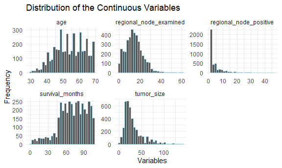
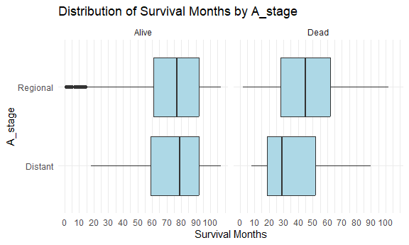
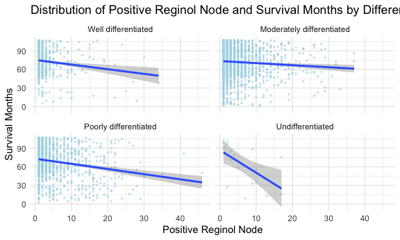
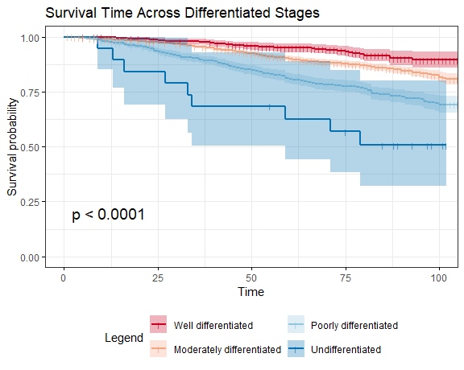

P8130_final_project
================
Leonor Rui
2024-12-03

# Appendix

- Data Import

``` r
survival_df = read_csv("data/Project_2_data.csv") |>
  janitor::clean_names()
```

- Data Description

``` r
str(survival_df)
```

    ## spc_tbl_ [4,024 × 16] (S3: spec_tbl_df/tbl_df/tbl/data.frame)
    ##  $ age                   : num [1:4024] 68 50 58 58 47 51 51 40 40 69 ...
    ##  $ race                  : chr [1:4024] "White" "White" "White" "White" ...
    ##  $ marital_status        : chr [1:4024] "Married" "Married" "Divorced" "Married" ...
    ##  $ t_stage               : chr [1:4024] "T1" "T2" "T3" "T1" ...
    ##  $ n_stage               : chr [1:4024] "N1" "N2" "N3" "N1" ...
    ##  $ x6th_stage            : chr [1:4024] "IIA" "IIIA" "IIIC" "IIA" ...
    ##  $ differentiate         : chr [1:4024] "Poorly differentiated" "Moderately differentiated" "Moderately differentiated" "Poorly differentiated" ...
    ##  $ grade                 : chr [1:4024] "3" "2" "2" "3" ...
    ##  $ a_stage               : chr [1:4024] "Regional" "Regional" "Regional" "Regional" ...
    ##  $ tumor_size            : num [1:4024] 4 35 63 18 41 20 8 30 103 32 ...
    ##  $ estrogen_status       : chr [1:4024] "Positive" "Positive" "Positive" "Positive" ...
    ##  $ progesterone_status   : chr [1:4024] "Positive" "Positive" "Positive" "Positive" ...
    ##  $ regional_node_examined: num [1:4024] 24 14 14 2 3 18 11 9 20 21 ...
    ##  $ reginol_node_positive : num [1:4024] 1 5 7 1 1 2 1 1 18 12 ...
    ##  $ survival_months       : num [1:4024] 60 62 75 84 50 89 54 14 70 92 ...
    ##  $ status                : chr [1:4024] "Alive" "Alive" "Alive" "Alive" ...
    ##  - attr(*, "spec")=
    ##   .. cols(
    ##   ..   Age = col_double(),
    ##   ..   Race = col_character(),
    ##   ..   `Marital Status` = col_character(),
    ##   ..   `T Stage` = col_character(),
    ##   ..   `N Stage` = col_character(),
    ##   ..   `6th Stage` = col_character(),
    ##   ..   differentiate = col_character(),
    ##   ..   Grade = col_character(),
    ##   ..   `A Stage` = col_character(),
    ##   ..   `Tumor Size` = col_double(),
    ##   ..   `Estrogen Status` = col_character(),
    ##   ..   `Progesterone Status` = col_character(),
    ##   ..   `Regional Node Examined` = col_double(),
    ##   ..   `Reginol Node Positive` = col_double(),
    ##   ..   `Survival Months` = col_double(),
    ##   ..   Status = col_character()
    ##   .. )
    ##  - attr(*, "problems")=<externalptr>

Numeric variables include `age`, `tumor_size`, `regional_node_examined`,
`reginol_node_positive`, and `survival_months`.

These are continuous variables that can be used for our later regression
analysis.

Categorical variables include `race`, `marital_status`, `t_stage`,
`n_stage`, `x6th_stage`, `differentiate`, `grade`, `a_stage`,
`estrogen_status`, `progesterone_status`, and `status`.

Then we will convert these variables into factors.

``` r
survival_df = survival_df |>
  mutate(
    race = factor(race),
    marital_status = factor(marital_status),
    t_stage = factor(t_stage),
    n_stage = factor(n_stage),
    x6th_stage = factor(x6th_stage),
    differentiate = factor(differentiate),
    grade = factor(grade),
    a_stage = factor(a_stage),
    estrogen_status = factor(estrogen_status),
    progesterone_status = factor(progesterone_status),
    status = factor(status)
  ) |>
  mutate(
    differentiate = factor(differentiate, levels = c("Well differentiated", 
                                                     "Moderately differentiated",
                                                     "Poorly differentiated",
                                                     "Undifferentiated")),
    differentiate = relevel(differentiate, ref = "Well differentiated")
  )
```

``` r
summary(survival_df)
```

    ##       age           race        marital_status t_stage   n_stage   x6th_stage 
    ##  Min.   :30.00   Black: 291   Divorced : 486   T1:1603   N1:2732   IIA :1305  
    ##  1st Qu.:47.00   Other: 320   Married  :2643   T2:1786   N2: 820   IIB :1130  
    ##  Median :54.00   White:3413   Separated:  45   T3: 533   N3: 472   IIIA:1050  
    ##  Mean   :53.97                Single   : 615   T4: 102             IIIB:  67  
    ##  3rd Qu.:61.00                Widowed  : 235                       IIIC: 472  
    ##  Max.   :69.00                                                                
    ##                    differentiate                   grade          a_stage    
    ##  Well differentiated      : 543   1                   : 543   Distant :  92  
    ##  Moderately differentiated:2351   2                   :2351   Regional:3932  
    ##  Poorly differentiated    :1111   3                   :1111                  
    ##  Undifferentiated         :  19   anaplastic; Grade IV:  19                  
    ##                                                                              
    ##                                                                              
    ##    tumor_size     estrogen_status progesterone_status regional_node_examined
    ##  Min.   :  1.00   Negative: 269   Negative: 698       Min.   : 1.00         
    ##  1st Qu.: 16.00   Positive:3755   Positive:3326       1st Qu.: 9.00         
    ##  Median : 25.00                                       Median :14.00         
    ##  Mean   : 30.47                                       Mean   :14.36         
    ##  3rd Qu.: 38.00                                       3rd Qu.:19.00         
    ##  Max.   :140.00                                       Max.   :61.00         
    ##  reginol_node_positive survival_months   status    
    ##  Min.   : 1.000        Min.   :  1.0   Alive:3408  
    ##  1st Qu.: 1.000        1st Qu.: 56.0   Dead : 616  
    ##  Median : 2.000        Median : 73.0               
    ##  Mean   : 4.158        Mean   : 71.3               
    ##  3rd Qu.: 5.000        3rd Qu.: 90.0               
    ##  Max.   :46.000        Max.   :107.0

## Descriptive table for numerical variables

``` r
summary_table = survival_df |> 
  summarise(
    age_Mean = mean(age, na.rm = TRUE),
    age_SD = sd(age, na.rm = TRUE),
    age_Median = median(age, na.rm = TRUE),
    age_IQR = IQR(age, na.rm = TRUE),
    
    tumor_size_Mean = mean(tumor_size, na.rm = TRUE),
    tumor_size_SD = sd(tumor_size, na.rm = TRUE),
    tumor_size_Median = median(tumor_size, na.rm = TRUE),
    tumor_size_IQR = IQR(tumor_size, na.rm = TRUE),
    
    regional_node_examined_Mean = mean(regional_node_examined, na.rm = TRUE),
    regional_node_examined_SD = sd(regional_node_examined, na.rm = TRUE),
    regional_node_examined_Median = median(regional_node_examined, na.rm = TRUE),
    regional_node_examined_IQR = IQR(regional_node_examined, na.rm = TRUE),
    
    reginol_node_positive_Mean = mean(reginol_node_positive, na.rm = TRUE),
    reginol_node_positive_SD = sd(reginol_node_positive, na.rm = TRUE),
    reginol_node_positive_Median = median(reginol_node_positive, na.rm = TRUE),
    reginol_node_positive_IQR = IQR(reginol_node_positive, na.rm = TRUE),
    
    survival_months_Mean = mean(survival_months, na.rm = TRUE),
    survival_months_SD = sd(survival_months, na.rm = TRUE),
    survival_months_Median = median(survival_months, na.rm = TRUE),
    survival_months_IQR = IQR(survival_months, na.rm = TRUE)
  )

final_table = data.frame(
  Variable = c("Age", "Tumor Size", "Regional Nodes Examined", "Regional Nodes Positive", "Survival Months"),
  Mean = c(summary_table$age_Mean, summary_table$tumor_size_Mean, 
           summary_table$regional_node_examined_Mean, summary_table$reginol_node_positive_Mean, 
           summary_table$survival_months_Mean),
  SD = c(summary_table$age_SD, summary_table$tumor_size_SD, 
         summary_table$regional_node_examined_SD, summary_table$reginol_node_positive_SD, 
         summary_table$survival_months_SD),
  Median = c(summary_table$age_Median, summary_table$tumor_size_Median, 
             summary_table$regional_node_examined_Median, summary_table$reginol_node_positive_Median, 
             summary_table$survival_months_Median),
  IQR = c(summary_table$age_IQR, summary_table$tumor_size_IQR, 
          summary_table$regional_node_examined_IQR, summary_table$reginol_node_positive_IQR, 
          summary_table$survival_months_IQR)
)

print(final_table)
```

    ##                  Variable      Mean        SD Median IQR
    ## 1                     Age 53.972167  8.963134     54  14
    ## 2              Tumor Size 30.473658 21.119696     25  22
    ## 3 Regional Nodes Examined 14.357107  8.099675     14  10
    ## 4 Regional Nodes Positive  4.158052  5.109331      2   4
    ## 5         Survival Months 71.297962 22.921430     73  34

``` r
numeric_summary = survival_df |> 
  summarize(
    age_Mean = mean(age, na.rm = TRUE),
    age_SD = sd(age, na.rm = TRUE),
    age_Median = median(age, na.rm = TRUE),
    age_IQR = IQR(age, na.rm = TRUE),
    
    tumor_size_Mean = mean(tumor_size, na.rm = TRUE),
    tumor_size_SD = sd(tumor_size, na.rm = TRUE),
    tumor_size_Median = median(tumor_size, na.rm = TRUE),
    tumor_size_IQR = IQR(tumor_size, na.rm = TRUE),
    
    regional_node_examined_Mean = mean(regional_node_examined, na.rm = TRUE),
    regional_node_examined_SD = sd(regional_node_examined, na.rm = TRUE),
    regional_node_examined_Median = median(regional_node_examined, na.rm = TRUE),
    regional_node_examined_IQR = IQR(regional_node_examined, na.rm = TRUE),
    
    reginol_node_positive_Mean = mean(reginol_node_positive, na.rm = TRUE),
    reginol_node_positive_SD = sd(reginol_node_positive, na.rm = TRUE),
    reginol_node_positive_Median = median(reginol_node_positive, na.rm = TRUE),
    reginol_node_positive_IQR = IQR(reginol_node_positive, na.rm = TRUE),
    
    survival_months_Mean = mean(survival_months, na.rm = TRUE),
    survival_months_SD = sd(survival_months, na.rm = TRUE),
    survival_months_Median = median(survival_months, na.rm = TRUE),
    survival_months_IQR = IQR(survival_months, na.rm = TRUE)
  )

numeric_table = data.frame(
  Variable = c("Age", "Tumor Size", "Regional Nodes Examined", "Regional Nodes Positive", "Survival Months"),
  Mean = c(numeric_summary$age_Mean, numeric_summary$tumor_size_Mean, 
           numeric_summary$regional_node_examined_Mean, numeric_summary$reginol_node_positive_Mean, 
           numeric_summary$survival_months_Mean),
  SD = c(numeric_summary$age_SD, numeric_summary$tumor_size_SD, 
         numeric_summary$regional_node_examined_SD, numeric_summary$reginol_node_positive_SD, 
         numeric_summary$survival_months_SD),
  Median = c(numeric_summary$age_Median, numeric_summary$tumor_size_Median, 
             numeric_summary$regional_node_examined_Median, numeric_summary$reginol_node_positive_Median, 
             numeric_summary$survival_months_Median),
  IQR = c(numeric_summary$age_IQR, numeric_summary$tumor_size_IQR, 
          numeric_summary$regional_node_examined_IQR, numeric_summary$reginol_node_positive_IQR, 
          numeric_summary$survival_months_IQR)
)

categorical_table = survival_df |> 
  summarize(
    estrogen_status_Positive = sum(estrogen_status == "Positive", na.rm = TRUE),
    estrogen_status_Negative = sum(estrogen_status == "Negative", na.rm = TRUE),
    progesterone_status_Positive = sum(progesterone_status == "Positive", na.rm = TRUE),
    progesterone_status_Negative = sum(progesterone_status == "Negative", na.rm = TRUE),
    status_Alive = sum(status == "Alive", na.rm = TRUE),
    status_Dead = sum(status == "Dead", na.rm = TRUE)
  )

categorical_long = data.frame(
  Variable = c("Estrogen Status Positive", "Estrogen Status Negative",
               "Progesterone Status Positive", "Progesterone Status Negative",
               "Status Alive", "Status Dead"),
  Count = c(categorical_table$estrogen_status_Positive, categorical_table$estrogen_status_Negative,
            categorical_table$progesterone_status_Positive, categorical_table$progesterone_status_Negative,
            categorical_table$status_Alive, categorical_table$status_Dead),
  Proportion = round(c(
    categorical_table$estrogen_status_Positive / nrow(survival_df),
    categorical_table$estrogen_status_Negative / nrow(survival_df),
    categorical_table$progesterone_status_Positive / nrow(survival_df),
    categorical_table$progesterone_status_Negative / nrow(survival_df),
    categorical_table$status_Alive / nrow(survival_df),
    categorical_table$status_Dead / nrow(survival_df)
  ), 4)
)

final_table = list(
  Numeric_Summary = numeric_table,
  Categorical_Summary = categorical_long
)

print("Numeric Variables Summary")
```

    ## [1] "Numeric Variables Summary"

``` r
print(numeric_table)
```

    ##                  Variable      Mean        SD Median IQR
    ## 1                     Age 53.972167  8.963134     54  14
    ## 2              Tumor Size 30.473658 21.119696     25  22
    ## 3 Regional Nodes Examined 14.357107  8.099675     14  10
    ## 4 Regional Nodes Positive  4.158052  5.109331      2   4
    ## 5         Survival Months 71.297962 22.921430     73  34

``` r
print("Categorical Variables Summary")
```

    ## [1] "Categorical Variables Summary"

``` r
print(categorical_long)
```

    ##                       Variable Count Proportion
    ## 1     Estrogen Status Positive  3755     0.9332
    ## 2     Estrogen Status Negative   269     0.0668
    ## 3 Progesterone Status Positive  3326     0.8265
    ## 4 Progesterone Status Negative   698     0.1735
    ## 5                 Status Alive  3408     0.8469
    ## 6                  Status Dead   616     0.1531

``` r
cat("### Numeric Variables Summary\n")
```

    ## ### Numeric Variables Summary

``` r
knitr::kable(numeric_table, col.names = c("Variable Name", "Mean", "SD", "Median", "IQR"), 
      caption = "Summary Statistics for Numeric Variables", format = "pipe")
```

| Variable Name           |      Mean |        SD | Median | IQR |
|:------------------------|----------:|----------:|-------:|----:|
| Age                     | 53.972167 |  8.963134 |     54 |  14 |
| Tumor Size              | 30.473658 | 21.119696 |     25 |  22 |
| Regional Nodes Examined | 14.357107 |  8.099675 |     14 |  10 |
| Regional Nodes Positive |  4.158052 |  5.109331 |      2 |   4 |
| Survival Months         | 71.297962 | 22.921429 |     73 |  34 |

Summary Statistics for Numeric Variables

``` r
# Print Categorical Variables Table
cat("\n### Categorical Variables Summary\n")
```

    ## 
    ## ### Categorical Variables Summary

``` r
knitr::kable(categorical_long, col.names = c("Variable Name", "Count", "Proportion"), 
      caption = "Summary Statistics for Categorical Variables", format = "pipe")
```

| Variable Name                | Count | Proportion |
|:-----------------------------|------:|-----------:|
| Estrogen Status Positive     |  3755 |     0.9332 |
| Estrogen Status Negative     |   269 |     0.0668 |
| Progesterone Status Positive |  3326 |     0.8265 |
| Progesterone Status Negative |   698 |     0.1735 |
| Status Alive                 |  3408 |     0.8469 |
| Status Dead                  |   616 |     0.1531 |

Summary Statistics for Categorical Variables

The majority of patients in the dataset are White, accounting for
approximately 84.82% of the total population. Black patients make up
7.23%, and patients classified as “Other” constitute 7.95%. This
imbalance suggests that the dataset is heavily skewed towards White
patients, which could influence the generalizability of the findings to
other racial groups.

The wide range of values in variables such as `tumor_size`,
`regional_node_examined`, and `survival_months` indicates the need to
explore relationships and their potential nonlinearities with survival,
giving us a possible analytical regression model.

Since the two variables `grade` and `differentiate` represent the same
variable with different names, we will not consider the variable `grade`
in the further analysis.

``` r
colSums(is.na(survival_df))
```

    ##                    age                   race         marital_status 
    ##                      0                      0                      0 
    ##                t_stage                n_stage             x6th_stage 
    ##                      0                      0                      0 
    ##          differentiate                  grade                a_stage 
    ##                      0                      0                      0 
    ##             tumor_size        estrogen_status    progesterone_status 
    ##                      0                      0                      0 
    ## regional_node_examined  reginol_node_positive        survival_months 
    ##                      0                      0                      0 
    ##                 status 
    ##                      0

We can conclude that no missing values are present in this dataset
across all variables.

``` r
survival_df |>
  group_by(differentiate, race) |>
  summarise(count = n(), .groups = "drop") |>
  pivot_wider(
    names_from = differentiate,
    values_from = count,
    values_fill = list(count = 0)
  )
```

    ## # A tibble: 3 × 5
    ##   race  `Well differentiated` `Moderately differentiated` Poorly differentiate…¹
    ##   <fct>                 <int>                       <int>                  <int>
    ## 1 Black                    32                         141                    115
    ## 2 Other                    46                         180                     94
    ## 3 White                   465                        2030                    902
    ## # ℹ abbreviated name: ¹​`Poorly differentiated`
    ## # ℹ 1 more variable: Undifferentiated <int>

This table shows the frequency of different levels of `differentiate` by
races.

``` r
survival_df |>
  group_by(x6th_stage, status) |>
  summarise(count = n(), .groups = "drop") |>
  pivot_wider(
    names_from = status,
    values_from = count
  )
```

    ## # A tibble: 5 × 3
    ##   x6th_stage Alive  Dead
    ##   <fct>      <int> <int>
    ## 1 IIA         1209    96
    ## 2 IIB          995   135
    ## 3 IIIA         866   184
    ## 4 IIIB          47    20
    ## 5 IIIC         291   181

This table shows the frequency of different levels of `status` by 6th
stage.

- Data Visualization

# Distributions of the numeric variables

<div class="figure">


<p class="caption">
Distribution of the Continuous Variables
</p>

</div>

Most patients are aged between 40 and 70 years. The data is well spread
across middle and older age groups, making it possible for age-related
analysis. Therefore, age will likely be a significant predictor for
later analysis.

Then is the distribution of different number of positive reginol node
for each subject. Over 2500 subjects only have 1 or 2 positive reginol
nodes, which is the most frequent number of positive reginol nodes. It
is strongly right-skewed, so we will use the log transformation for this
variable.

The third plot maps the frequency of different number of examined
regional nodes for each subject. The number of examined regional nodes
for most subjects are smaller than 30, and the subjects with nearly 12
examined regional nodes are the most.

Then is the distribution of the survival months, most of the survival
time are larger than 45 months.

The last one is the distribution of all tumor sizes, and most of the
tumor sizes are smaller than 50 mm. We can find that the most frequent
size is around 19 mm, followed by around 14 mm. This distribution is
right-skewed, so we will use the log transformation for this variable.

# Bewteen Variables

## Survival Months by Status

<div class="figure">


<p class="caption">
Survival_Months_by_Status
</p>

</div>

The Alive group has a higher median survival time (approximately 75
months) with a relatively narrow interquartile range. However, there are
several outliers below 15 survival months, indicating cases of unusually
short survival. In contrast, the Dead group has a lower median survival
time (around 45 months) with a wider interquartile range, reflecting
greater variability. Overall, survival months are significantly higher
for the Alive group compared to the Dead group.

## Tumor Sizes by T_stage

<div class="figure">


<p class="caption">
Tumor Sizes by T_stage
</p>

</div>

In this plot, we explore the tumor size distribution at different T
stages. From T1 to T3, as the stage changes, both the mean tumor sizes
and IQR become larger. At T4 stage, the IQR of tumor sizes is much
larger than others, and the mean size is smaller than the mean size at
T3 stage. We notice that there are some potential outliers both ar T1
stage and T3 stage.

## Survival Months by A_stage Based on Status

<div class="figure">


<p class="caption">
Survival Months by A_stage Based on Status
</p>

</div>

In the Regional stage, the Alive group has a higher median survival with
outliers below 15 months, while the Dead group shows a lower median with
no outliers. For the Distant stage, survival times are shorter overall,
with the Alive group having a median of 80 months and the Dead group
around 30 months, both without significant outliers. Overall, survival
is longer in the Regional stage, and the Alive group shows higher
survival times across both stages.

## Tumor Size by Differentiate

<div class="figure">


<p class="caption">
Tumor Size by Differentiate
</p>

</div>

The Undifferentiated group has larger tumor sizes compared to the other
categories, while the Well, Moderately, and Poorly differentiated groups
show similar distributions with many smaller tumors and numerous
high-value outliers.

## Relationship Between Age and Tumor Size across Status

<div class="figure">


<p class="caption">
Relationship Between Age and Tumor Size across Status
</p>

</div>

This figure highlights the differences in tumor size distribution and
trends with age between individuals who are alive and those who are
deceased. While the “Alive” group shows no significant relationship
between age and tumor size, the “Dead” group exhibits a pattern where
larger tumors are associated with younger ages.

## Positive Reginol Node vs Survival Months Across Differentiate

<div class="figure">


<p class="caption">
Positive Reginol Node vs Survival Months Across Differentiate
</p>

</div>

According to the trend lines, as it changes from undifferentiated to
well differentiated, the negative correlation between the number of
positive reginol nodes and the survival months becomes weaker. At the
undifferentiated level, the correlation is strong. AS the number of
positive reginol nodes increases, the survival months will decrease.

# Transformations

``` r
survival_df = survival_df |>
  mutate(
    log_tumor_size = log(tumor_size),
    log_reginol_node_positive = log(reginol_node_positive)
  )
```

Since variables `tumor_size` and `reginol_node_positive` are skewed to
the right, we need to use the log transformation and add new variables
`log_tumor_size` and `log_reginol_node_positive` for further analysis.

``` r
survival_df |> 
  pivot_longer(
    cols = c(age, tumor_size, regional_node_examined, reginol_node_positive, survival_months),
    names_to = "variable",
    values_to = "value"
  ) |>
  ggplot(aes(x = value)) +
  geom_histogram() +
  facet_wrap(variable ~ .,  scales = "free")
```


# Model Building

## Preparation

``` r
survival_df = 
  survival_df |>
  mutate(status = if_else(status == "Dead", 1, 0))

full_glm = glm(status ~ age + race + marital_status + t_stage + n_stage + x6th_stage +
                 differentiate + grade + a_stage + tumor_size + estrogen_status +
                 progesterone_status + regional_node_examined + reginol_node_positive, 
               data = survival_df, family = binomial)

alias(full_glm)$Complete %>%
  as.data.frame() %>%  
  rownames_to_column("aliased_variables") %>% 
  as_tibble() %>% 
  pivot_longer(
    cols = -aliased_variables,
    names_to = "aliased_with", 
    values_to = "value"
  ) %>% 
  filter(value != 0) %>% 
  select(-value)
```

    ## # A tibble: 4 × 2
    ##   aliased_variables         aliased_with                          
    ##   <chr>                     <chr>                                 
    ## 1 x6th_stageIIIC            n_stageN3                             
    ## 2 grade2                    differentiateModerately differentiated
    ## 3 grade3                    differentiatePoorly differentiated    
    ## 4 gradeanaplastic; Grade IV differentiateUndifferentiated

First, we use variables 1-14 to build a logistic regression. In this
full model, we observe that the number of each level in the variable
`grade` is the same as the variable `differentiate`, and the number of
level `IIIC` in the variable `x6th_stage` is exactly the same with level
`N3` in the variable `n_stage`.

By looking up the relevant information on the staging system for breast
cancer, we can see that the breast cancer grade (i.e. variable `grade`)
is based on how much the cancer cells look like normal cells, which is
highly similar to the meaning of the variable `differentiate`.
Therefore, the variable `grade` can be removed from the model.

In addition, the AJCC system (variable `x6th_stage`) is based on 7
aspects: the extent (size) of the tumor (T), the spread to nearby lymph
nodes (N), the spread (metastasis) to distant sites (M), Estrogen
Receptor (ER) status, Progesterone Receptor (PR) status, HER2 status and
grade of the cancer (G). It can be seen that some of the evaluation
criteria are already included in other variables.

However, since the AJCC system is complex and levels other than `IIIC`
do not correlate with other variables, we cannot simply remove this
variable from the model. We will discuss this variable further when it
comes to this.

## Logistic Regression Model

### Automated Procedure

#### Forward Selection

``` r
full_glm = glm(status ~ age + race + marital_status + t_stage + n_stage + x6th_stage +
                 differentiate + a_stage + tumor_size + estrogen_status +
                 progesterone_status + regional_node_examined + reginol_node_positive, 
               data = survival_df, family = binomial)

forward_glm = MASS::stepAIC(full_glm, direction = "forward", trace = FALSE)

forward_glm %>% 
  broom::tidy() %>% 
  knitr::kable(digits = 4)
```

| term                                   | estimate | std.error | statistic | p.value |
|:---------------------------------------|---------:|----------:|----------:|--------:|
| (Intercept)                            |  -2.3128 |    0.5138 |   -4.5017 |  0.0000 |
| age                                    |   0.0242 |    0.0056 |    4.3008 |  0.0000 |
| raceOther                              |  -0.9235 |    0.2486 |   -3.7149 |  0.0002 |
| raceWhite                              |  -0.5098 |    0.1618 |   -3.1504 |  0.0016 |
| marital_statusMarried                  |  -0.2103 |    0.1418 |   -1.4832 |  0.1380 |
| marital_statusSeparated                |   0.6718 |    0.3875 |    1.7338 |  0.0830 |
| marital_statusSingle                   |  -0.0678 |    0.1751 |   -0.3871 |  0.6987 |
| marital_statusWidowed                  |   0.0235 |    0.2210 |    0.1061 |  0.9155 |
| t_stageT2                              |   0.2822 |    0.1954 |    1.4443 |  0.1487 |
| t_stageT3                              |   0.5359 |    0.3138 |    1.7079 |  0.0876 |
| t_stageT4                              |   0.9542 |    0.4501 |    2.1202 |  0.0340 |
| n_stageN2                              |   0.6208 |    0.2392 |    2.5955 |  0.0094 |
| n_stageN3                              |   0.6910 |    0.3007 |    2.2977 |  0.0216 |
| x6th_stageIIB                          |   0.2143 |    0.2318 |    0.9245 |  0.3552 |
| x6th_stageIIIA                         |  -0.0871 |    0.2950 |   -0.2954 |  0.7677 |
| x6th_stageIIIB                         |   0.0887 |    0.5289 |    0.1677 |  0.8668 |
| x6th_stageIIIC                         |       NA |        NA |        NA |      NA |
| differentiateModerately differentiated |   0.5368 |    0.1841 |    2.9159 |  0.0035 |
| differentiatePoorly differentiated     |   0.9252 |    0.1929 |    4.7974 |  0.0000 |
| differentiateUndifferentiated          |   1.8983 |    0.5567 |    3.4101 |  0.0006 |
| a_stageRegional                        |  -0.0402 |    0.2662 |   -0.1508 |  0.8801 |
| tumor_size                             |   0.0002 |    0.0040 |    0.0627 |  0.9500 |
| estrogen_statusPositive                |  -0.7419 |    0.1779 |   -4.1703 |  0.0000 |
| progesterone_statusPositive            |  -0.5861 |    0.1277 |   -4.5899 |  0.0000 |
| regional_node_examined                 |  -0.0359 |    0.0072 |   -4.9924 |  0.0000 |
| reginol_node_positive                  |   0.0791 |    0.0154 |    5.1473 |  0.0000 |

#### Backward Elimination

``` r
backward_glm = MASS::stepAIC(full_glm, direction = "backward", trace = FALSE)

backward_glm %>% 
  broom::tidy() %>% 
  knitr::kable(digits = 4)
```

| term                                   | estimate | std.error | statistic | p.value |
|:---------------------------------------|---------:|----------:|----------:|--------:|
| (Intercept)                            |  -2.2838 |    0.4385 |   -5.2085 |  0.0000 |
| age                                    |   0.0238 |    0.0056 |    4.2426 |  0.0000 |
| raceOther                              |  -0.9346 |    0.2485 |   -3.7616 |  0.0002 |
| raceWhite                              |  -0.5148 |    0.1617 |   -3.1845 |  0.0014 |
| marital_statusMarried                  |  -0.2110 |    0.1416 |   -1.4900 |  0.1362 |
| marital_statusSeparated                |   0.6691 |    0.3881 |    1.7240 |  0.0847 |
| marital_statusSingle                   |  -0.0646 |    0.1748 |   -0.3696 |  0.7117 |
| marital_statusWidowed                  |   0.0175 |    0.2211 |    0.0791 |  0.9369 |
| t_stageT2                              |   0.4111 |    0.1130 |    3.6372 |  0.0003 |
| t_stageT3                              |   0.5516 |    0.1488 |    3.7077 |  0.0002 |
| t_stageT4                              |   1.0988 |    0.2445 |    4.4934 |  0.0000 |
| n_stageN2                              |   0.4363 |    0.1284 |    3.3987 |  0.0007 |
| n_stageN3                              |   0.5872 |    0.2345 |    2.5034 |  0.0123 |
| differentiateModerately differentiated |   0.5328 |    0.1838 |    2.8990 |  0.0037 |
| differentiatePoorly differentiated     |   0.9190 |    0.1924 |    4.7772 |  0.0000 |
| differentiateUndifferentiated          |   1.8649 |    0.5538 |    3.3672 |  0.0008 |
| estrogen_statusPositive                |  -0.7480 |    0.1775 |   -4.2140 |  0.0000 |
| progesterone_statusPositive            |  -0.5842 |    0.1275 |   -4.5811 |  0.0000 |
| regional_node_examined                 |  -0.0359 |    0.0072 |   -5.0110 |  0.0000 |
| reginol_node_positive                  |   0.0797 |    0.0153 |    5.2076 |  0.0000 |

#### Stepwise Regression

``` r
stepwise_glm = MASS::stepAIC(full_glm, direction = "both", trace = FALSE)

stepwise_glm %>% 
  broom::tidy() %>% 
  knitr::kable(digits = 4)
```

| term                                   | estimate | std.error | statistic | p.value |
|:---------------------------------------|---------:|----------:|----------:|--------:|
| (Intercept)                            |  -2.2838 |    0.4385 |   -5.2085 |  0.0000 |
| age                                    |   0.0238 |    0.0056 |    4.2426 |  0.0000 |
| raceOther                              |  -0.9346 |    0.2485 |   -3.7616 |  0.0002 |
| raceWhite                              |  -0.5148 |    0.1617 |   -3.1845 |  0.0014 |
| marital_statusMarried                  |  -0.2110 |    0.1416 |   -1.4900 |  0.1362 |
| marital_statusSeparated                |   0.6691 |    0.3881 |    1.7240 |  0.0847 |
| marital_statusSingle                   |  -0.0646 |    0.1748 |   -0.3696 |  0.7117 |
| marital_statusWidowed                  |   0.0175 |    0.2211 |    0.0791 |  0.9369 |
| t_stageT2                              |   0.4111 |    0.1130 |    3.6372 |  0.0003 |
| t_stageT3                              |   0.5516 |    0.1488 |    3.7077 |  0.0002 |
| t_stageT4                              |   1.0988 |    0.2445 |    4.4934 |  0.0000 |
| n_stageN2                              |   0.4363 |    0.1284 |    3.3987 |  0.0007 |
| n_stageN3                              |   0.5872 |    0.2345 |    2.5034 |  0.0123 |
| differentiateModerately differentiated |   0.5328 |    0.1838 |    2.8990 |  0.0037 |
| differentiatePoorly differentiated     |   0.9190 |    0.1924 |    4.7772 |  0.0000 |
| differentiateUndifferentiated          |   1.8649 |    0.5538 |    3.3672 |  0.0008 |
| estrogen_statusPositive                |  -0.7480 |    0.1775 |   -4.2140 |  0.0000 |
| progesterone_statusPositive            |  -0.5842 |    0.1275 |   -4.5811 |  0.0000 |
| regional_node_examined                 |  -0.0359 |    0.0072 |   -5.0110 |  0.0000 |
| reginol_node_positive                  |   0.0797 |    0.0153 |    5.2076 |  0.0000 |

The backward and stepwise procedure produced the same model.

### Criterion-based Procedure

``` r
model_selection =
  tibble(
    type = c("full", "forward", "backward", "stepwise"),
    model = list(full_glm, forward_glm, backward_glm, stepwise_glm)
    ) %>%
  mutate(
    result = map(model, broom::glance)
    ) %>%
  unnest(result) %>%
  select(type, AIC, BIC)

model_selection %>%
  knitr::kable(digits = 4, caption = "Model Selection")
```

| type     |      AIC |      BIC |
|:---------|---------:|---------:|
| full     | 3002.000 | 3159.500 |
| forward  | 3002.000 | 3159.500 |
| backward | 2993.771 | 3119.771 |
| stepwise | 2993.771 | 3119.771 |

Model Selection

``` r
final_glm = stepwise_glm
```

The Akaike information criterion (AIC) is an estimator of prediction
error and thereby relative quality of statistical models for a given set
of data, and models with lower AIC are generally preferred. Similarly,
the Bayesian information criterion (BIC) is also a criterion for model
selection among a finite set of models. They both resolve the
overfitting problem by introducing a penalty term for the number of
parameters in the model.

By comparing AIC and BIC, we can see the model given by backward
elimination or stepwise regression works slightly better than the full
model or forward selection model. Therefore, we will choose the former
to be our “best model”.

### Model Diagnostics

``` r
vif(final_glm) %>% 
  knitr::kable(digits = 4)
```

|                        |   GVIF |  Df | GVIF^(1/(2\*Df)) |
|:-----------------------|-------:|----:|-----------------:|
| age                    | 1.1072 |   1 |           1.0522 |
| race                   | 1.0629 |   2 |           1.0154 |
| marital_status         | 1.1291 |   4 |           1.0153 |
| t_stage                | 1.1019 |   3 |           1.0163 |
| n_stage                | 3.8068 |   2 |           1.3968 |
| differentiate          | 1.1171 |   3 |           1.0186 |
| estrogen_status        | 1.4754 |   1 |           1.2147 |
| progesterone_status    | 1.4275 |   1 |           1.1948 |
| regional_node_examined | 1.4778 |   1 |           1.2157 |
| reginol_node_positive  | 4.2484 |   1 |           2.0612 |

Variance Inflation Factor is a commonly used method for detecting
multicollinearity in regression models. VIF is generally calculated for
the continuous variables, and Generalized Variance Inflation Factor
(GVIF) is used for evaluating the multicollinearity for categorical
variables.

The adjusted GVIF (i.e. GVIF^(1/(2\*Df))) values are corrected for the
degree of freedom and provide a scale similar to VIF. The high adjusted
GVIF values (GVIF \> 2) indicate the presence of moderate to strong
multicollinearity.

The table shows that most variables do not show multicollinearity, with
the exception of `reginol_node_positive`. Since its adjusted GVIF is not
much different from 2, we will keep this variable for now.

``` r
augment(final_glm) |>
  ggplot(aes(x = .fitted, y = .std.resid)) +
  geom_point() +
  geom_smooth(se = FALSE) +
  labs(x = "Fitted value", y = "Residual")
```


``` r
augment_quantile(final_glm) |>
  ggplot(aes(x = .fitted, y = .quantile.resid)) +
  geom_point() +
  geom_smooth(se = FALSE) +
  labs(x = "Fitted value", y = "Randomized quantile residual")
```


By randomizing the quantile residuals, we resolve the problem that the
RVF plot always shows a pattern in logistic regression because of the
binary response variable. Since in the randomized quantile residual
vs. fitted value plot, the residuals distribute randomly around the 0.5
horizontal line, the residual assumption is met and the model is a good
fit.

``` r
plot(final_glm, which = 5)
```


The residual vs. leverage plot indicates that observations 3527, 1561,
and 3074 may be potential outliers, but they are not necessarily
influential.

### Odds Ratios

``` r
final_glm_summary = summary(final_glm)

final_glm_df = 
  as.data.frame(final_glm_summary$coefficients) |>
  janitor::clean_names() |>
  mutate(
    odds_ratio = exp(estimate)
  ) |>
  rename(p_value = pr_z)

final_glm_df %>% 
  knitr::kable(digits = 4)
```

|                                        | estimate | std_error | z_value | p_value | odds_ratio |
|:---------------------------------------|---------:|----------:|--------:|--------:|-----------:|
| (Intercept)                            |  -2.2838 |    0.4385 | -5.2085 |  0.0000 |     0.1019 |
| age                                    |   0.0238 |    0.0056 |  4.2426 |  0.0000 |     1.0241 |
| raceOther                              |  -0.9346 |    0.2485 | -3.7616 |  0.0002 |     0.3928 |
| raceWhite                              |  -0.5148 |    0.1617 | -3.1845 |  0.0014 |     0.5976 |
| marital_statusMarried                  |  -0.2110 |    0.1416 | -1.4900 |  0.1362 |     0.8097 |
| marital_statusSeparated                |   0.6691 |    0.3881 |  1.7240 |  0.0847 |     1.9526 |
| marital_statusSingle                   |  -0.0646 |    0.1748 | -0.3696 |  0.7117 |     0.9374 |
| marital_statusWidowed                  |   0.0175 |    0.2211 |  0.0791 |  0.9369 |     1.0176 |
| t_stageT2                              |   0.4111 |    0.1130 |  3.6372 |  0.0003 |     1.5085 |
| t_stageT3                              |   0.5516 |    0.1488 |  3.7077 |  0.0002 |     1.7360 |
| t_stageT4                              |   1.0988 |    0.2445 |  4.4934 |  0.0000 |     3.0005 |
| n_stageN2                              |   0.4363 |    0.1284 |  3.3987 |  0.0007 |     1.5470 |
| n_stageN3                              |   0.5872 |    0.2345 |  2.5034 |  0.0123 |     1.7989 |
| differentiateModerately differentiated |   0.5328 |    0.1838 |  2.8990 |  0.0037 |     1.7036 |
| differentiatePoorly differentiated     |   0.9190 |    0.1924 |  4.7772 |  0.0000 |     2.5069 |
| differentiateUndifferentiated          |   1.8649 |    0.5538 |  3.3672 |  0.0008 |     6.4551 |
| estrogen_statusPositive                |  -0.7480 |    0.1775 | -4.2140 |  0.0000 |     0.4733 |
| progesterone_statusPositive            |  -0.5842 |    0.1275 | -4.5811 |  0.0000 |     0.5576 |
| regional_node_examined                 |  -0.0359 |    0.0072 | -5.0110 |  0.0000 |     0.9647 |
| reginol_node_positive                  |   0.0797 |    0.0153 |  5.2076 |  0.0000 |     1.0829 |

### Cross Validation

``` r
log_loss = function(actual, predicted) {
  
  -mean(actual * log(predicted) + (1 - actual) * log(1 - predicted))
  
}

glm_fit = function(data) {
  
  fit = glm(formula = status ~ age + race + marital_status + t_stage + n_stage + 
        differentiate + estrogen_status + progesterone_status + 
        regional_node_examined + reginol_node_positive, 
        family = binomial, data = data)
  
  return(fit)
  
}

cv_df = 
  crossv_kfold(survival_df, k = 10) |>
  mutate(
    train = map(train, as_tibble),
    test = map(test, as_tibble)
  )

cv_res_df = 
  cv_df |>
  mutate(
    final_model = map(train, \(x) glm_fit(data = x)),
    predicted_probs = map2(final_model, test, \(fit, data)
                               predict(fit, newdata = data, type = "response")),
    actual_outcomes = map(test, pull, status),
    log_loss = map2_dbl(actual_outcomes, predicted_probs, \(x, y) log_loss(x, y)),
    AUC = map2_dbl(actual_outcomes, predicted_probs, \(x, y) {
      roc_obj = roc(x, y)  
      auc(roc_obj)  
    })
  )

cv_res_df %>% 
  select(log_loss, AUC) %>% 
  knitr::kable(digits = 4)
```

| log_loss |    AUC |
|---------:|-------:|
|   0.3681 | 0.6999 |
|   0.3639 | 0.7463 |
|   0.4069 | 0.7498 |
|   0.3773 | 0.7552 |
|   0.3575 | 0.7792 |
|   0.3780 | 0.7317 |
|   0.3679 | 0.6604 |
|   0.3636 | 0.7951 |
|   0.3681 | 0.7644 |
|   0.3718 | 0.7405 |

After applying 10-fold cross-validation, we evaluate the goodness of fit
by log loss and AUC. The mean of log loss is 0.3723182, and the mean of
AUC is 0.7422428.

### Evaluation Across Races

- Evaluate the performance of your model(s). Is your model achieving
  similar performance between the majority race group “White” and the
  minority “Black” (or “Black” + “Other”)? If not, could you try to
  improve the fairness (i.e., reducing the gap of prediction performance
  between the majority and minority) of your model(s)?

``` r
eval_produce = function(model, df) {
  
  results = 
    df %>% 
    mutate(predicted_probs = predict(model, newdata = ., type = "response")) %>% 
    group_by(race) %>% 
    summarize(
      log_loss = log_loss(status, predicted_probs),
      AUC = {
        roc_obj = roc(status, predicted_probs)
        auc_value = auc(roc_obj)  # Extract the numeric value of AUC
        as.numeric(auc_value)
        }
      ) %>% 
    ungroup() %>% 
    select(race, log_loss, AUC)
  
  return(results)
  
}

stra_cv_df = 
  survival_df %>%
  mutate(
    race = fct_collapse(
      race,
      "Black or other" = c("Black", "Other")  
    )
  ) %>% 
  vfold_cv(v = 10, strata = race) %>% 
  mutate(
    train = map(splits, training),
    test = map(splits, testing)
  )

stra_res_df = 
  stra_cv_df %>% 
  mutate(
    final_model = map(train, \(x) glm_fit(data = x)),
    results = map2(final_model, test, \(x, y) eval_produce(x, y))
  )

stra_res_df %>% 
  select(results) %>% 
  unnest(cols = c(results)) %>% 
  group_by(race) %>%
  summarise(
    avg_log_loss = mean(log_loss),
    avg_AUC = mean(AUC)
  ) %>% 
  knitr::kable(digits = 4)
```

| race           | avg_log_loss | avg_AUC |
|:---------------|-------------:|--------:|
| Black or other |       0.4231 |  0.6997 |
| White          |       0.3651 |  0.7502 |

Low log loss and high AUC indicate better test performance.

To reduce the gap of prediction performance between the majority and
minority, we can try to add an interaction term in the model.

``` r
glm_inter_fit = function(data) {
  
  fit = glm(formula = status ~ age + race + marital_status + t_stage + n_stage + 
        differentiate + estrogen_status + progesterone_status + 
        regional_node_examined + reginol_node_positive + age * race + marital_status * race, 
        family = binomial, data = data)
  
  return(fit)
  
}

inter_res_df = 
  stra_cv_df %>% 
  mutate(
    final_model = map(train, \(x) glm_inter_fit(data = x)),
    results = map2(final_model, test, \(x, y) eval_produce(x, y))
  ) 

inter_res_df %>% 
  select(results) %>% 
  unnest(cols = c(results)) %>% 
  group_by(race) %>%
  summarise(
    avg_log_loss = mean(log_loss),
    avg_AUC = mean(AUC)
  ) %>% 
  knitr::kable(digits = 4)
```

| race           | avg_log_loss | avg_AUC |
|:---------------|-------------:|--------:|
| Black or other |       0.4204 |  0.7220 |
| White          |       0.3648 |  0.7501 |

By adding interaction term `age * race` and `marital_status * race`, we
can observe a decrease in log loss and an increase in AUC, which means
an improve in the fairness between group “White” and the minority
“Black” + “Other”.

## Survival Analysis

``` r
surv_obj = Surv(time = survival_df$survival_months, event = survival_df$status)
```

### Kaplan Meier Curve

The Kaplan Meier curve graphically represent the survival rate. Time is
plotted on the x-axis and the survival rate is plotted on the y-axis.

``` r
km_fit = survfit(surv_obj ~ 1, data = survival_df)

ggsurvfit(km_fit, type = "survival", linewidth = 1) +
  labs(x = "Months", 
       y = "Overall survival",
       title = "Kaplan-Meier Survival Curve") +
  add_confidence_interval() +
  scale_ggsurvfit()
```


### Log Rank Test

The log rank test lets us test whether there is a difference in survival
times between groups of patients. For example, we want to find out
whether there is a significant difference in survival between patients
whose cells have different degrees of differentiation.

``` r
log_rank_fit = survfit(surv_obj ~ differentiate, data = survival_df)


log_rank_plot = 
  ggsurvplot(log_rank_fit, data = survival_df,
           size = 1, palette = "RdBu",
           censor.shape = '|', censor.size = 2,
           conf.int = TRUE, pval = TRUE,
           ggtheme = theme_bw(),
           legend = "bottom",
           legend.title = "Legend",
           legend.labs = c("Well differentiated", "Moderately differentiated",
                           "Poorly differentiated", "Undifferentiated"))

log_rank_plot$plot +
  ggtitle("Survival Time Across Differentiated Stages") +
  guides(color = guide_legend(nrow = 2))
```



### Cox Model

The limitation of KM curves and log-rank tests is that we can only test
one variable at a time. To further discuss the risk factors to survival
time, we will compute the cox proportional hazard model to adjusts for
multiple risk factors simultaneously.

``` r
cox_model = coxph(surv_obj ~ 
                    age + race + marital_status + t_stage + n_stage + x6th_stage +
                       differentiate + a_stage + tumor_size + estrogen_status +
                       progesterone_status + regional_node_examined + reginol_node_positive, 
                  data = as.data.frame(survival_df))
```

The cox proportional hazard model has a assumption: the survival curves
for two different strata of a risk factor must have hazard functions
that are proportional over time. This assumption is satisfied when the
change in hazard from one category to the next does not depend on time.
That is, a person in one stratum has the same instantaneous relative
risk compared to a person in a different stratum, irrespective of how
much time has passed.

We will test this assumption based on the scaled Schoenfeld residuals.
Here is an interpretation of the results: When p-val \< 0.05, there is
evidence against the proportional hazards assumption, meaning that the
HR is not constant over time. Similarly, the larger the chi-square
value, the greater the violation of the assumption.

``` r
cox.zph(cox_model) %>%
  .$table %>%
  as.data.frame() %>% 
  knitr::kable(digits = 4)
```

|                        |   chisq |  df |      p |
|:-----------------------|--------:|----:|-------:|
| age                    |  0.1328 |   1 | 0.7156 |
| race                   |  0.9335 |   2 | 0.6270 |
| marital_status         |  2.6670 |   4 | 0.6150 |
| t_stage                |  0.2144 |   3 | 0.9752 |
| n_stage                |  1.7178 |   2 | 0.4236 |
| x6th_stage             |  3.8545 |   3 | 0.2776 |
| differentiate          |  1.8899 |   3 | 0.5956 |
| a_stage                |  5.2218 |   1 | 0.0223 |
| tumor_size             |  0.9310 |   1 | 0.3346 |
| estrogen_status        | 28.9294 |   1 | 0.0000 |
| progesterone_status    | 32.1281 |   1 | 0.0000 |
| regional_node_examined |  0.0187 |   1 | 0.8912 |
| reginol_node_positive  |  0.0324 |   1 | 0.8571 |
| GLOBAL                 | 57.2155 |  24 | 0.0002 |

We can see from the table that variable `a_stage`, `estrogen_status`,
`progesterone_status` are not constant over time, which means it’s not
proper to contain these covariates in cox regression. To reduce bias of
the model, we can remove these variables and take a closer look at the
result.

``` r
cox_new_model = coxph(surv_obj ~ age + race + marital_status + t_stage + n_stage + x6th_stage +
                      differentiate + tumor_size + regional_node_examined + reginol_node_positive,
                    data = as.data.frame(survival_df))

ggforest(cox_new_model,
         fontsize = 0.6)
```


The hazard ratio is similar to relative risk, but differs in that the HR
is the instantaneous risk rather than the cumulative risk over the
entire study.

The x-axis of this forest plot represents hazard ratios. Hazard ratio =
1 means no significant difference compared to the reference, and a HR
higher than 1 means it increases the hazard ratio of the event, death,
and a HR lower than 1 decreases it. The smaller the p-value is the
stronger the weight of evidence that the two groups are different.

We can conclude from the plot that for the variable race, blacks have
the highest risk of death, followed by whites, while the lowest
mortality rate is for other ethnic groups. In the variable marital
status, the risk of death is significantly higher for separated people,
but this may be due to information bias caused by fewer observations.
The confidence intervals for the other categories of marital status all
contain the null hypothesis, meaning that there is no significant
difference.

The risk of death is highest for patients with N stage N3, followed by
N2, and finally N1. Differently, although T stage also shows a similar
trend, the confidence intervals of each stage level contain the null
hypothesis, meaning that there is no significant difference between
levels. For the 6th stage, IIIB has the highest risk of death, followed
by IIB, and then IIA, but there is no significant difference. For stage
IIIC, since it contains the same information as N3 of N stage, no
comparison is made in this variable.

In the variable differentiated, the risk of death is significantly
highest for undifferentiated, and then decreases in the order of poorly
differentiated, moderately differentiated, and well differentiated.

For the variables tumor size, regional node examined, and reginol node
postive, we did not observe significant differences in the risk of
death.
